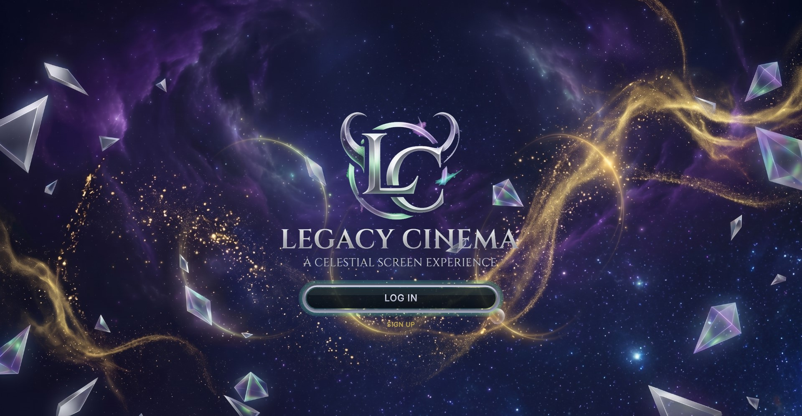
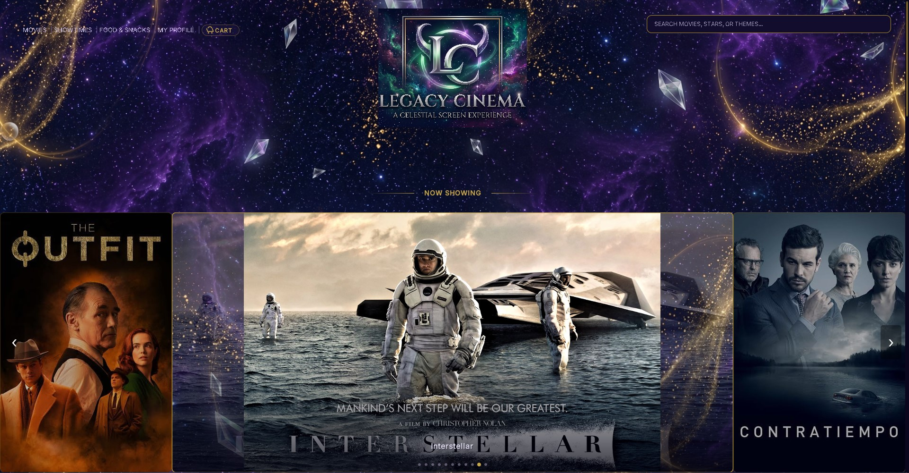
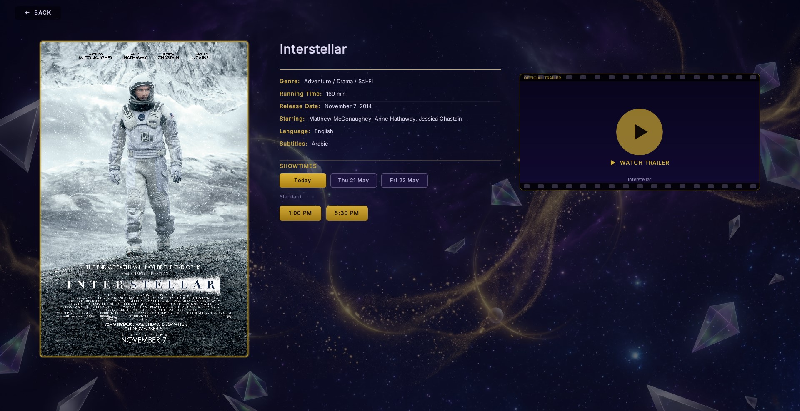
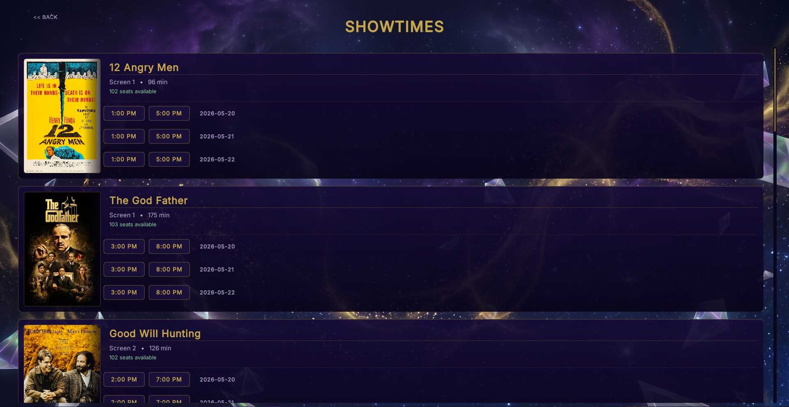
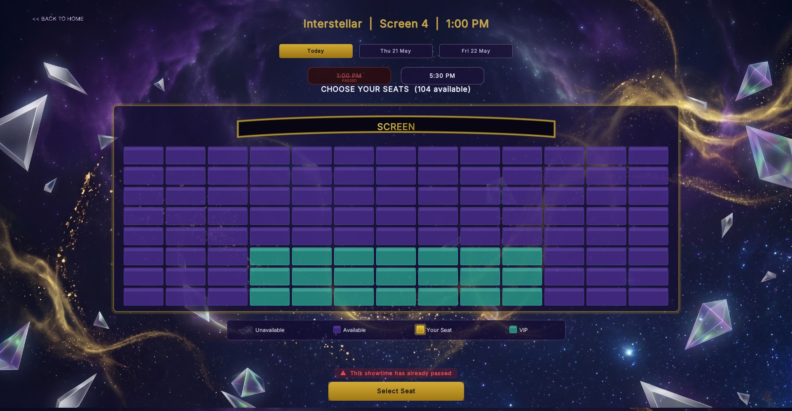
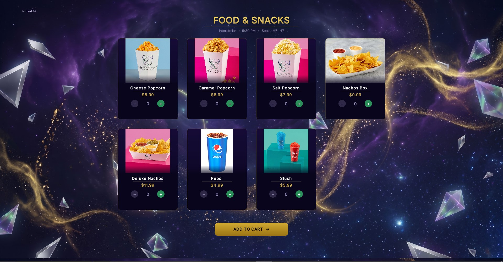
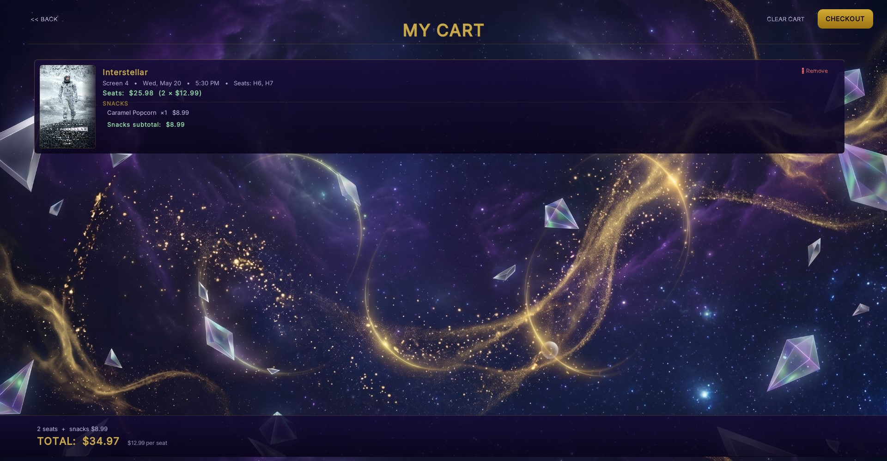
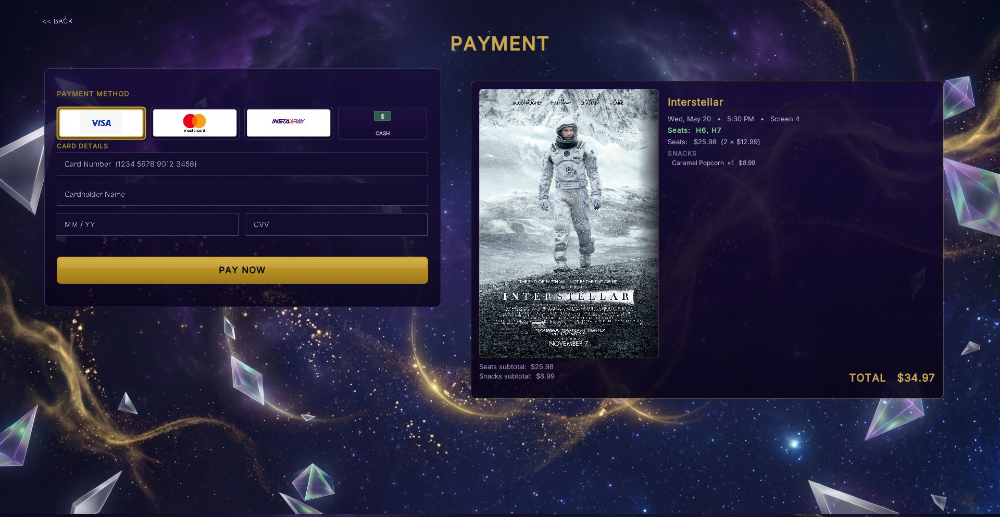
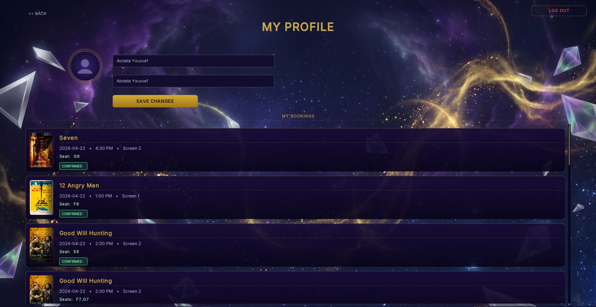
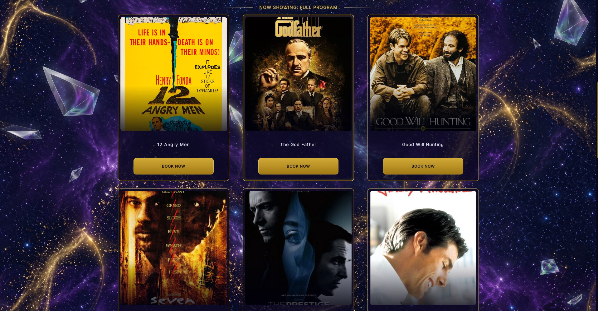

# 🎬 Legacy Cinema

A full-featured **cinema booking desktop application** built with Java Swing as a 1st-year CS project at Nile University.

---

## ✨ Features

- 🎥 **Movie Browser** — Browse 12+ classic films with posters and details
- 🗓️ **Schedule System** — View showtimes across 3 screens for 3 days
- 💺 **Seat Selection** — Interactive seat map with real-time availability
- 🍿 **Food & Snacks** — Order popcorn, drinks, and snacks with your ticket
- 🛒 **Cart System** — Review and manage your full order before payment
- 💳 **Payment Gateway** — Supports Visa, Mastercard, and Instapay
- 👤 **User Authentication** — Register, login, and manage your account
- 🔐 **Admin Panel** — Manage bookings, view sales reports, monitor activity
- 📊 **Sales Dashboard** — Track revenue and booking statistics

---

## 🏗️ Project Structure

src/legacycinema/

├── LegacyCinemaApp.java      # Main entry point

├── MainFrame.java            # Application window manager

├── SplashScreen.java         # Animated launch screen

├── HomeScreen.java           # Movie browsing homepage

├── MovieCard.java            # Individual movie display card

├── MovieDetailScreen.java    # Full movie info & booking

├── ScheduleScreen.java       # Showtime schedule view

├── SeatSelectionScreen.java  # Interactive seat picker

├── FoodSnacksScreen.java     # Food & beverage ordering

├── CartScreen.java           # Order summary & cart

├── PaymentScreen.java        # Payment processing

├── AuthDialog.java           # Login & registration

├── AdminScreen.java          # Admin dashboard

├── SalesScreen.java          # Sales analytics

├── UserManager.java          # User account management

├── CinemaData.java           # Movies & schedules data

└── CelestialPanel.java       # Custom animated UI panel

---

## 🚀 How to Run

**Requirements:** Java 8 or higher

```bash
# Clone the repository
git clone https://github.com/AbdallaYoussef006/LegacyCinema.git

# Navigate to project
cd LegacyCinema

# Run the app (Windows)
run.bat

# Or compile manually
javac -d out src/legacycinema/*.java
java -cp out legacycinema.LegacyCinemaApp
```

---

📸 Preview
## 📸 Preview

### 🌌 Splash Screen


### 🎬 Home Screen


### 🎥 Movie Details


### 🗓️ Showtimes


### 💺 Seat Selection


### 🍿 Food & Snacks


### 🛒 Cart


### 💳 Payment


### 👤 My Profile


### 🎞️ Full Movie Grid



## 🎓 About

Built as a **1st Semester Project** at Nile University, Faculty of Computer Science.  
Demonstrates: OOP design, Java Swing GUI, file-based data persistence, MVC-like architecture.

**Developer:** Abdalla Mohamed  
**University:** Nile University, Cairo, Egypt  
**Year:** 2026
